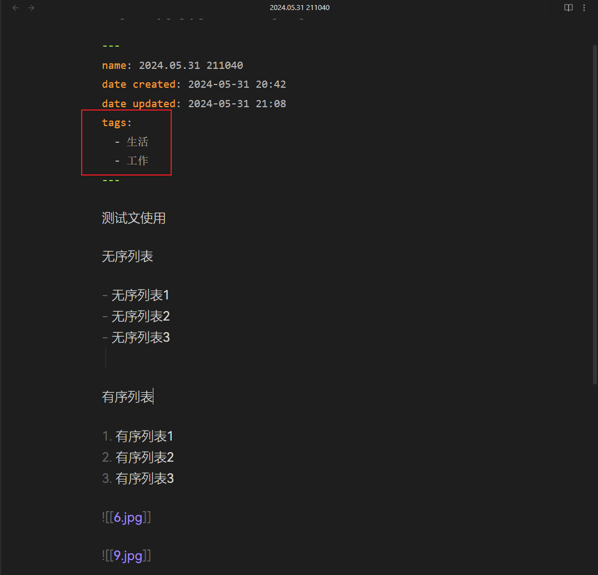

# 简介


一个数据迁移小脚本

用于将flomo导出数据，归档至Obsidian库中（将数据转换成Markdown，放入OB库中）

本版本，图片自动上传阿里OSS，图片链接转换为OSS图床链接
主版本`main`使用离线图片，根据需要自行选择


## 依赖库

```py
pip install beautifulsoup4
pip install oss2
```

- `beautifulsoup4`：解析HTML
- `oss2`：用于存储空间的操作

## 转换效果

flomo的元信息会被转化成文件名/YAML值（name属性的属性值）
采用年.月.日 时间戳（6位数）格式


flomo的图片会自动追加到正文的最后


flomo标签会自动追加到YAML中，正文的标签会被移除




注：由于导出数据没有附带id信息，所以正文中引用的Memo链接无法转换


# 使用方法

1. 打开Flomo，点击「帐号详情」
    
2. 点击导出数据，下载压缩包
   
3. 将压缩包解压
   
4. 填写数据所在位置
   - 修改变量`file_path`，修改为flomo导出数据（解压文件夹中html）位置
   - 修改变量`save_path`，修改成Obsidian库所在位置

5. 填写OSS相关信息，用于上传图片及转换链接
   - 修改变量`auth`，填入自己阿里云的id和secret
      格式：`auth = oss2.Auth(id, secret)`
   - 修改变量`bucket_space`，填入自己桶的存储空间名称
   - 修改变量`endpoint`，填入自己桶的**外网Endpoint**
      地域节点具体参考[公共云下OSS Region和Endpoint对照表](https://help.aliyun.com/zh/oss/user-guide/regions-and-endpoints?spm=a2c4g.11186623.0.i2#concept-zt4-cvy-5db)找到其中的**外网Endpoint**，或者在自己桶的概览中找到
   - 修改变量`oss_imgDir`为图片上传路径，不填，默认在存储桶根目录下新建一个`img`文件夹存储

6. 执行脚本即可


